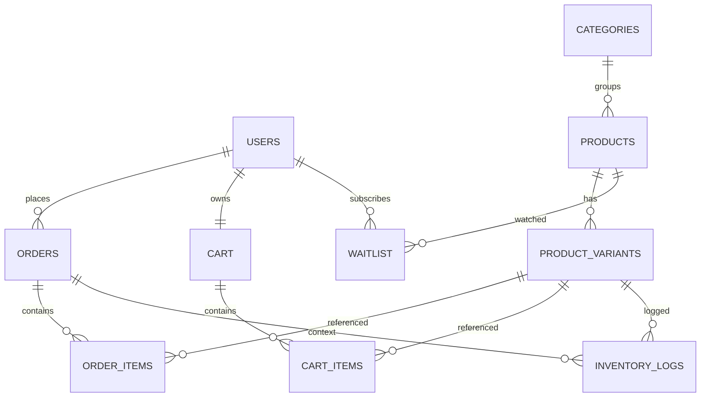

# Diseño de Base de Datos - Paw Paw Urban Show

## Esquema General

## Tablas Clave

-   USERS: Identidad de clientes y administradores.
-   CATEGORIES: Agrupación del catálogo.
-   PRODUCTS: Producto base, incluye información de drops.
-   PRODUCT_VARIANTS: Variantes por talla/color y stock.
-   ORDERS / ORDER_ITEMS: Modelo transaccional de pedidos.
-   CART / CART_ITEMS: Carritos persistentes.
-   WAITLIST: Lista de espera para drops.
-   INVENTORY_LOGS: Auditoría de movimientos de inventario.

## Índices

-   idx_products_drop_date_is_drop sobre (drop_date, is_drop) para consultas de drops.
-   idx_orders_user_created_at sobre (user_id, created_at) para historiales.
-   idx_products_name_fts índice GIN para búsqueda full-text.

## Estrategia de RLS

-   ORDERS: Los usuarios solo leen pedidos donde user_id coincide con el claim JWT user_id.
-   USERS: Cada usuario solo puede leer su propio registro.
-   ADMIN: Identificado por claim role = 'admin'.

## Integridad Referencial

-   Eliminación de productos cascades a variantes y waitlist.
-   Eliminación de usuarios cascades a cart y waitlist.
-   ORDER_ITEMS se elimina al borrar el ORDER asociado.

