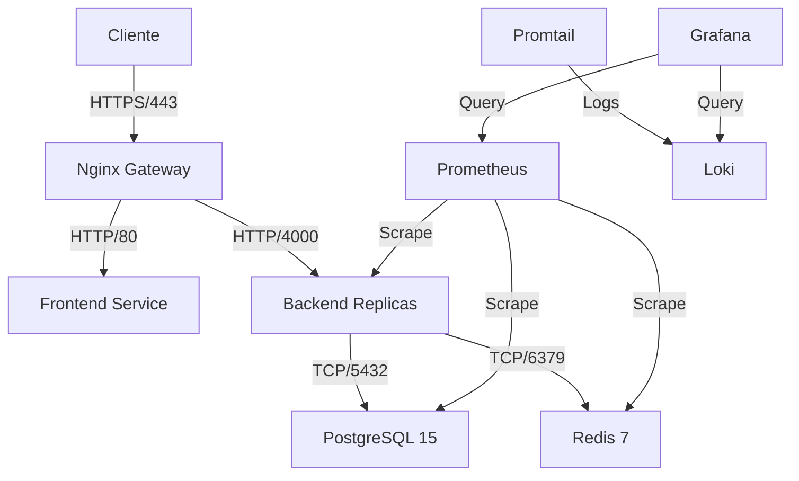

# Manual de Operaciones DevOps - Paw Paw Torreón

## 1. Arquitectura de Infraestructura

### Stack Tecnológico
- **Frontend**: React 18, Vite, Nginx
- **Backend**: Node.js 20, Express, TypeScript
- **Base de Datos**: PostgreSQL 15 (Primary/Replica en Prod)
- **Cache**: Redis 7 (AOF Persistence)
- **Monitoring**: Prometheus, Grafana, Loki, Promtail
- **CI/CD**: GitHub Actions

### Diagrama de Servicios (Docker Compose Prod)


## 2. Despliegue (Deployment)

### Entorno de Desarrollo
Para iniciar el entorno local con hot-reloading y volúmenes montados:
```bash
docker compose up -d
# Ver logs
docker compose logs -f
# Reconstruir imágenes
docker compose up -d --build
```

### Entorno de Producción
Para desplegar en servidor de producción:
```bash
# 1. Configurar variables de entorno
cp .env.example .env
# Editar .env con credenciales reales

# 2. Iniciar servicios (detached)
docker compose -f docker-compose.prod.yml up -d

# 3. Verificar estado
docker compose -f docker-compose.prod.yml ps
```

### CI/CD Pipeline
El pipeline en GitHub Actions (`.github/workflows/ci-cd.yml`) se ejecuta en push a `main`:
1. **Test**: Ejecuta tests de backend y frontend.
2. **Build**: Construye imágenes Docker.
3. **Deploy**: (Pendiente de configurar con proveedor cloud específico).

## 3. Monitoreo y Observabilidad

### Acceso a Dashboards
- **Grafana**: `http://localhost:3001` (Usuario: `admin`, Password: `pawpaw_monitoring`)
- **Prometheus**: `http://localhost:9090`

### Métricas Clave
- **Backend**: `/metrics` (expuesto por `express-prom-bundle`)
- **PostgreSQL**: Estado de conexión, transacciones activas.
- **Redis**: Uso de memoria, hit rate.

### Logging
Los logs son recolectados por **Promtail** desde los contenedores Docker y enviados a **Loki**.
En Grafana, usar datasource Loki y query `{container_name="pawpaw_backend"}`.

## 4. Runbooks (Procedimientos Operativos)

### RB-01: Restaurar Base de Datos
Si la base de datos se corrompe o se pierden datos:
1. Identificar el backup más reciente en `./backups` (o S3).
2. Detener el servicio de base de datos:
   ```bash
   docker compose -f docker-compose.prod.yml stop backend postgres
   ```
3. Iniciar solo postgres:
   ```bash
   docker compose -f docker-compose.prod.yml up -d postgres
   ```
4. Restaurar backup (ejemplo con archivo local):
   ```bash
   cat backups/backup_2024-01-01.sql.gz | gunzip | docker exec -i pawpaw_db_prod psql -U postgres -d pawpaw_db
   ```
5. Reiniciar todos los servicios:
   ```bash
   docker compose -f docker-compose.prod.yml up -d
   ```

### RB-02: Rotación de Secretos
1. Generar nuevos secretos (JWT, DB passwords).
2. Actualizar archivo `.env` en el servidor.
3. Actualizar Secrets en GitHub Repository.
4. Reiniciar servicios para aplicar cambios:
   ```bash
   docker compose -f docker-compose.prod.yml up -d --force-recreate
   ```

### RB-03: Incidente de Alta Latencia
1. Verificar dashboards de Grafana (CPU/RAM usage).
2. Si CPU > 80%, considerar escalar horizontalmente (añadir réplicas):
   ```bash
   # Editar docker-compose.prod.yml (replicas: 3)
   docker compose -f docker-compose.prod.yml up -d --scale backend=3
   ```
3. Verificar logs de Nginx y Backend en busca de errores 5xx.

## 5. Seguridad

- **SSL/TLS**: Configurado en Nginx. Asegurar renovación de certificados (Certbot).
- **Network**: Backend y DB están en red interna, no expuestos directamente a internet (solo vía Nginx).
- **Usuarios**: Contenedores corren como usuario no-root (node).
- **Backups**: Automatizados diariamente con retención de 30 días.

## 6. Mantenimiento
- **Actualización de Dependencias**: Ejecutar `npm audit` y `npm update` regularmente.
- **Limpieza de Docker**:
  ```bash
  docker system prune -a --volumes # Cuidado: borra todo lo no usado
  ```
