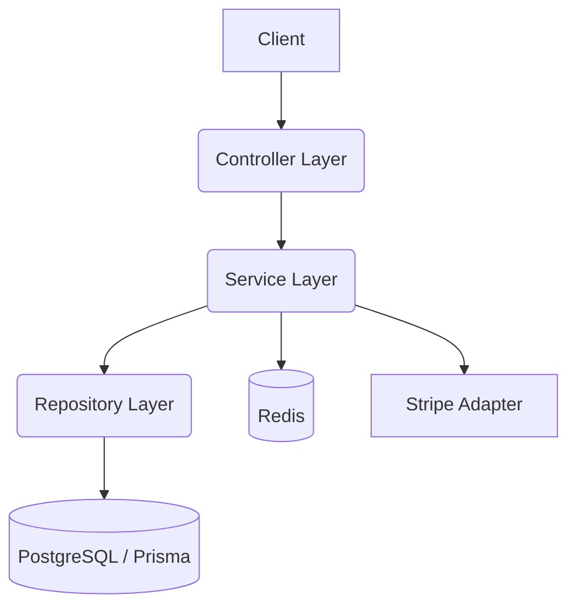

# Migración a TypeScript y Prisma

Este documento detalla la estrategia de migración del backend actual (JavaScript Vanilla) a una arquitectura robusta basada en TypeScript y Prisma.

## 1. Justificación Arquitectónica

La adopción de TypeScript y Prisma responde a las siguientes necesidades críticas identificadas en el sistema de Checkout de Paw Paw Urban Show:

*   **Type Safety (Seguridad de Tipos):** El flujo de checkout maneja estructuras de datos complejas (reservas, items, respuestas de Stripe). TypeScript elimina una clase entera de errores en tiempo de ejecución (ej. acceder a propiedades inexistentes, errores de tipado en cálculos de dinero) y mejora la autodocumentación del código.
*   **Gestión de Transacciones ACID:** El flujo de reserva requiere operaciones atómicas (verificar stock -> decrementar stock -> crear log). Prisma ofrece una API de transacciones (`$transaction`) intuitiva y segura que garantiza la integridad de los datos, esencial para evitar *overbooking*.
*   **Mantenibilidad y Escalabilidad:** La estructura actual carece de separación de responsabilidades. Una arquitectura en capas (Controller -> Service -> Repository) facilita el testing unitario, la reutilización de lógica y el onboarding de nuevos desarrolladores.
*   **Alineación con Estándares de la Industria:** TypeScript y Prisma son el estándar de facto en el ecosistema Node.js moderno, asegurando soporte a largo plazo y acceso a un amplio ecosistema de herramientas.

## 2. Estructura de Capas Propuesta

Se implementará una arquitectura de 3 capas estricta para desacoplar la lógica de negocio de la infraestructura.

### Responsabilidades:

1.  **Controllers (`src/controllers`):**
    *   Manejo de peticiones HTTP (req, res).
    *   Validación de entrada (usando Zod).
    *   Autenticación y autorización básica.
    *   Delegación a servicios.
    *   Mapeo de errores de negocio a códigos HTTP.

2.  **Services (`src/services`):**
    *   **Núcleo de la lógica de negocio.**
    *   Orquestación de flujos (ej. Checkout: reservar -> pagar -> confirmar).
    *   Manejo de transacciones ACID.
    *   Interacción con adaptadores externos (Redis, Stripe).
    *   *No conocen HTTP ni SQL directo.*

3.  **Repositories (`src/repositories`):**
    *   Abstracción del acceso a datos.
    *   Interacción directa con Prisma Client.
    *   Métodos granulares (ej. `findProductVariantById`, `updateStock`).

## 3. Propuesta de Schema Prisma

El siguiente schema refleja la estructura actual de la base de datos PostgreSQL (`001_initial_schema.sql`), añadiendo las relaciones necesarias para Prisma.

*(Ver archivo `backend/prisma/schema.prisma` para la implementación completa)*

## 4. Plan de Migración

La migración se ejecutará en fases para minimizar el riesgo y permitir la entrega continua de valor.

### Fase 1: Setup y Coexistencia (Semana 1)
*   [ ] Inicializar TypeScript, `tsconfig.json`, `package.json`.
*   [ ] Instalar Prisma y generar cliente (`npx prisma generate`).
*   [ ] Configurar Docker para desarrollo local (Postgres + Redis).
*   [ ] Configurar Jest para testing.

### Fase 2: Migración Vertical del Checkout (Semana 2)
*   *Objetivo:* Migrar el flujo más crítico primero para validar la arquitectura.
*   [ ] Implementar `CheckoutRepository` con Prisma.
*   [ ] Implementar `CheckoutService` con lógica de reserva y transacciones.
*   [ ] Implementar `CheckoutController`.
*   [ ] Migrar endpoints: `POST /checkout/reserve` y `POST /checkout/confirm`.
*   [ ] Tests de integración para estos endpoints.

### Fase 3: Migración del Resto de Módulos (Semana 3-4)
*   [ ] Productos y Catálogo.
*   [ ] Carrito de Compras.
*   [ ] Usuarios y Autenticación.
*   [ ] Webhooks de Stripe.

### Fase 4: Limpieza y Optimización (Semana 5)
*   [ ] Eliminar código JS legacy (`index.js`, `db.js`).
*   [ ] Refactorizar middlewares.
*   [ ] Auditoría de seguridad y performance.

## 5. Estrategia de Testing

*   **Unit Tests (Jest):** Foco en la capa de Servicios. Se mockearán los Repositorios y Redis.
*   **Integration Tests (Supertest + Jest):** Foco en Controllers. Se usará una base de datos de prueba (Dockerizada) y se limpiará entre tests.
*   **E2E Tests:** Flujos críticos completos (ej. Usuario se loguea -> Añade al carrito -> Reserva -> Paga).

## 6. Consideraciones DevOps

*   **Docker:** Se actualizará el `Dockerfile` para soportar el build de TypeScript (multi-stage build).
*   **CI/CD:** Pipeline para correr linter, type-check y tests antes del deploy.
*   **Migraciones:** Prisma Migrate gestionará los cambios de esquema futuros, manteniendo la compatibilidad con los datos existentes.
